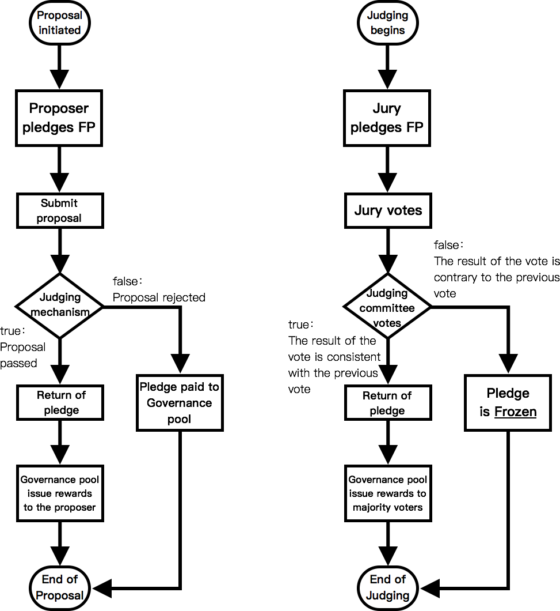

# Fountain Whitepaper V0.94en
**A content ecosystem based on PoC**

*Thanks Steem, a pioneer.*

# Mission and vision
Fountain is a block-chained content ecosystem based on Proof of Contribution. Through a set of clear proof of contribution rules, blockchain technology is used to record the contributions of all participants. After accurate calculation, tokens are awarded to all participants. This will effectively motivate people to participate deeply in a content community application and the entire ecosystem, contributing to their strength.

With the constant growth and development of the ecology, Fountain has a rich content community application, and the author, readers, curators, IP investors, block nodes, application developers and many other roles will be taken from the token. Their income. The ultimate realization of our vision: a win-win, sustainable content ecosystem.

# Preface
The core concept of Fountain stems from the problems of traditional Internet content community applications: users of content community applications have made great contributions to the community, but they have not been able to obtain effective contribution credits and rewards.

For example, content community applications such as Twitter (Weibo) and Quora (Zhihu), a large number of users have made the following contributions to the application:

* User-contributed original content
* Users contribute their own time for reading and vote to the high-quality content.
* Users contributed their own comments and commit to community activities

The application has been developed in the process of user contribution. The app has gained billions of dollars or even billions of dollars in market value, but it has nothing to do with most users, which is manifestly unreasonable. I believe we all have the same example of empathy:

>You are an author on Quora. During the year, you have created many quality posts, and your post has received a lot of approval. Obviously, you contributed to Quora. One year later, you left Quora for some reason, but you didn't get any proof of contribution and reward.
>
>Imagine that there is a Quora built on Fountain. In the same situation as above, when you leave Quora, you can get 1 million tokens based on the proof of contribution. In the circulation market, the value of 1 million tokens can be 10,000 dollars.
>
>Which is more reasonable? Which Quora would you choose?

Therefore, we came up with Fountain's design principles: a relatively fair contribution should support any participant who contributes to the development of the community.

It can be seen that the core of Fountain is how to design an open and transparent proof of contribution rule, which we call it PoC (Proof of Contribution). We will explain in detail in the PoC mechanism section.

# Partner
Since the development of the blockchain industry, the application ecology of the public chain has not been developed, which is a severe problem. For example, Ethereum's data analysis in September 2018 shows that the total daily life of all DApps in Ethereum is less than 10,000, also with a slight decline from the beginning of the year.

In terms of application ecological development, we believe that the blockchain industry should build an ecosystem with the application of massive user base in the Internet industry. Fountain will strive to bring more Internet content community applications into the ecosystem through rational rule design, achieve a win-win situation and promote the development of the blockchain industry.

In order to harvest Fountain participants more quickly and efficiently, we chose to work intensively with China's premium original content community “Jianshu”. In the course of many years of operation, "Jianshu" has accumulated a large number of active users and a large number of high-quality contents, and has a vision that is highly compatible with Fountain. It can be the best partner for us.

"Jianshu" was established in 2013 and has now developed into China's premier creative community. Relying on convenient creative tools and intelligent distribution strategies, we have gathered a large number of high-quality authors and works, which are very popular among young people. The team has received multiple rounds of financing from SIG Heiner Asia, “Junlian” Capital, “Saifu” Investment Fund, “Gobi” Venture Capital and other quality investment institutions.

"Jianshu" has been launched on the web, iOS, Android and other mainstream platforms. With a total registered number of users of more than 12 million, an average of 3 new contents are published every 3 seconds, and the average monthly traffic is 200 million times. Up to now, its main site (http://jianshu.com) has a global Alexa ranking of about 500 and China's ranking of about 60. The R&D team always pays attention to good product design and experience, and is bound to break the current situation of "unrealistic design," " hard to use," "slow starting".

As the “Jianshu” joins the Fountain Ecology, the massive active users of “Jianshu” will become blockchain users, “Jianshu” users will receive the token rewards they deserve, and “Jianshu” will increase the user activity through the incentive of tokens. Moreover, as a founding cooperative application, get the distribution return of the initial token. This is a win-win cooperation.

Comparison of “Jianshu” and Steemit data:

|    | **Jianshu**   | **Steemit**   | 
|:----|:----:|:----:|
| Site   | http://jianshu.com   | http://steemit.com   | 
| Language   | Mainly Chinese   | Mainly English   | 
| Alexa ranking   | **No.500**   | No.1700   | 
| Mobile App   | **iOS、android**   | N/A   | 
| Registering   | **Free registering instantly**   | Paid instant registering / queuing for free registering   | 
| Users   | **12 million**   | 1.1 million   | 
| Active users per day   | **Site 2 million +App 0.5 million**   | Site 0.25 million   | 
| Main features   | Chinese authoring community with high completion, excellent user experience, stable content traffic, recommendation engine with intelligent algorithm   | The decentralized creation community driven by the blockchain. It has a high-value circulation model, high visibility in overseas markets, and early entry advantages of the blockchain.   | 

 
“Jianshu” is Fountain's first and most important partner, but there is no doubt that we will work hard to expand the ecosystem of more partners to join Fountain. Especially the products of East and Southeast Asian countries. This plan is designed because Steem's current main user advantage lies in the English-speaking countries. Fountain is based on the “Jianshu” in China, far surpassing Steem's user advantage, and is more suitable for developing partners and users in East Asia and Southeast Asia. We do not rule out the possibility of directly incubating, investing in or acquiring content community applications in China, Korea, Japan and Southeast Asia to accelerate ecological development. Please refer to Appendix 1 for more partner expansion plans.

# Token
We believe that the performance of all users in the community is valuable and contributes more or less to the community, so we designed tokens to prove these contributions. All tokens constitute the value of the entire Fountain ecology, and the token of Fountain is called FTN.

## FTN
FTN is Fountain's most fundamental value record unit. There are two ways to get FTN. Obtained through contributions to the community, or through market transactions. The former is more critical because the user must have the time to contribute to the community in order to increase the overall value of it. Therefore, we must design a PoC (Proof of Contribution) mechanism to effectively measure the contribution of all community users and reward tokens accordingly.

## Initial allocation
The initial total amount of FTN is 3 billion.

Of these, 1.5 billion will be used as foundation reserves, which will be used for initial community consensus building, partner testing, long-term incentives for core teams, daily operations and investments. At the same time, the reserved funds will also be used to curb short-term speculative speculation that may be manipulated by large investors. Of these, 500 million will be given "Jianshu" to thank for its support to Fountain. The remaining 1 billion will be used for community support programs, and the proceeds will be used for the development, operation and marketing of Fountain.

| **Usage**   | **Qty (Billion)**   | **Percentage**   | **Lock period**   | 
|:----|:----|:----|:----|
| Community support plan   | 10   | 33%   | 6+12 months (unlocked after 6 months of the first round of delivery, linearly unlocking every day for 1 year)   | 
| Foundation   | 15   | 50%   | 12+48 months (300 million initial unlocks, the remaining 1.2 billion unlocked after 12 months of the first round of delivery, linearly unlocking every day for 4 years   | 
| Partner   | 5   | 17%   | 12+24 months (unlock after 12 months of the first round of delivery, linearly unlock every day for 2 years)   | 
| Total   | 30   | 100%   |    | 

## Additional allocation
Based on the essential characteristics of the content community. Users continue to create new and valuable content to share with all users so that the value of the community as a whole is growing, so we believe that the complete deflation or constant total Token economy does not apply in such a fast-growing community that encourages content production and consumption. We will issue 1 million additional FTNs per day for eco-incentives. The first-year increase rate is about 12%, and then it will decrease year by year, approaching zero eventually.

85% of the annual FTN will be based on the PoC (Proof of Contribution) consensus mechanism for community rewards, 10% will be based on the DPoS consensus mechanism for reward block production, and the remaining 5% will be converted to Foundation reserves. Safeguard the sustainability of the Foundation. To reduce speculation, all FTN awards will likely be given to users in the form of FP.

| **Items**   | **Role**   | **Percentage**   | 
|:----|:----|:----|
| Community reward (PoC)   | FP Holder   | 15%   | 
|    | Content contribution (author, voter)   | 55%   | 
|    | Operational contribution (proposer, judge, introducer)   | 15%   | 
| Block production reward(DPoS)   | witness   | 10%   | 
| Foundation   |    | 5%   | 
| Total   |    | 100%   | 

# PoC Mechanism
The design of the PoC (Proof of Contribution) mechanism for community user contribution certification is extremely important. Only by effectively rewarding the daily labor contributions of all community users, the entire ecology can be properly motivated, and the ecology will continue to grow in the direction of growth. All holders will also receive good profits in return with the development of the ecology. We must clarify how community users contribute effectively and design FTN rewards based on these contributions.

## FP
We will encourage long-term holders of FTN because the long-term holding of FTN means the true participation of the holders in the ecology, and they will vote based on the long-term sustainability of Fountain. The short-term holders will take the opportunity to buy low and sell high, and cannot make practical contributions to the development of ecology. Their behavior and will must not be consistent with Fountain's vision.

In view of this, we designed FP (Fountain Power ). Users can convert FTN to FP at a 1:1 ratio at any time. However, when the user chooses to convert the FP to FTN, the total amount of the FTN is divided into 13 equal shares, one redeems per week, and the 13-week redemption is completed. FP cannot be circulated and must be redeemed for FTN before it can be circulated.

FP is Fountain's entitlement credit. Holding FP is like becoming a citizen of Fountain, fulfilling obligations for ecological prosperity and governance, while enjoying legitimate rights. FP is the core of the entire PoC operation. The design of the PoC mechanism is based on the principle of **one FP one vote**. The more users are holding the FP, the bigger the influence of the allocation of the PoC reward pool.

Because the active vote of users holding FP is the guarantee of the entire ecological operation, 15% of the annual increase will be awarded to FP holders, and users are encouraged to convert FTN into FP to participate in the voting. The rewards that each FP holder receives are determined by the proportion of FP they hold to the total amount of FP held by all users.

## Content contribution
Content is the most critical value in the Fountain, and the author of the content deserves to be rewarded. The user's vote for the content is the curation of the content and the process of adding value to the content, so the voter should also be rewarded. Content-rewarding rewards are designed around the author's contribution to the creation and the contribution of the reader's curation. 55% of the annual additional FTN will be used as a reward pool for this part.

## Voting weight
The author publishes the content, and the reader reads the content and generates voting behaviors such as likes or dislikes, and each reader holds a different FP, and the voting weight is different.

The total number of times that user *i* votes in the statistical period (ie, one day) is , then the weight assigned to each click or point is: 

Where  is the total number of FPs owned by user *i* (if the number of FPs in the user changes within one day, the last FP number is used);  is the reserve;  is the number of votes for user *i* on the current day.

Unlike Steem, the content on Fountain can be always voted. This means that a novel ten years ago can still be voted and rewarded by users today.

## Content heat
After calculating the weight of each vote, we can calculate the heat value of the content based on the reader's vote for each content. We believe that whether it got likes or dislikes, it only represents the values of different users, and there is no right or wrong in itself, so it should be regarded as voting.

See Content heat value calculation method below:

Here  is the voting weight of the user *i* who likes or clicks,  is the sum of the voting weights of all the people who like, and  is the sum of the voting weights of all the people who step on.

We think that comments are content, and the heat of article comments is a reflection of the popularity of the article. Therefore, the final heat value of each content will be calculated by adding the voting heat value of the sub-comment:

Where  is the voting heat value of the content itself, and the subsequent summation part is to sum the voting heat values of the sub-comments.  is the weight parameter of the sub-review which is currently set to 0.5.

## Content reward distribution
In general, moderate heat articles are the majority, the articles with particularly high heat and extremely low heat are relatively few, close to the Beta distribution, as shown below:

Here, the horizontal axis represents the heat value, and the vertical axis represents the number of articles. The heat average value of  or less (ie, the red part) is defined as the tail content. And adjust its weight:

We sort The tail content from high to low according to the heat value. According to Ziff's law, the maximum heat value in the tail content is divided by the sorting number as the new weight. This minimizes the weight of the tail's irrigation content while retaining a certain amount of revenue.

According to the rules mentioned above, the weight of an article now is:

Where  is the heat value of the content,  is the maximum heat value of the tail, and  is the sorting number of the tail content. The final income distribution formula is:

Where  is the reward for an article,  is the total number of FPs to be allocated, and  is the sum of the weight distribution weights of all content on the day.

After the content revenue is determined, it will be redistributed among the author and the voter of the content, and the distribution ratio is 80% for the author and 20% for the voter. So the rewards the author gets are:

According to the voting weight of each voter, the proportion of the total voting weight of each content is equal to the reward obtained by assigning 20% of the articles or comments belonging to the voter:

## Operational contribution
In addition to content contributions, operational-based contributions are also significant. We include community contribution contributions and introduction and promotion contributions that have fundamental values in the application and operation of the content community and are included in the rewards. 15% of the additional annual FTN will be used as a reward pool for this part.

## Community governance reward
For content community applications, governance around violating content and violating user behavior is critical (such as copying someone else's work). For the application official, this piece of operation is weighty, and at the same time makes users feel unfair. Therefore, we encourage community users to participate in public affairs and give FTN rewards, which reduces the official workload of the application, and gives users a sense of participation and the whole process is transparent.

The sponsors and judges involved in community governance and construction will adopt the following process:

* Pledge: The proposer pledges a certain amount of FP to submit a community governance proposal.
* Judgment: whether the proposal is passed, whether the penalty is accurate, and whether the sponsor is compliant.
* Decommissioning: If the judgment is passed, the pledge target is released and returned; if not, it will be included in the community contributor quota pool.
* Benefits: At the same time as the demolition, the sponsor will receive additional rewards from the pool of community contributors.

Since the number of participants per day and the amount of pledge are dynamically changing, and the amount of contributor quota pool is fixed, to solve this problem, we have designed the following mechanism:

* If all participating hostages are less than or equal to the increase of the contributor's quota pool on the day, after the participants receive the same amount of reward as their respective pledges, the remaining portion of the pool will be transferred to the next-day contributor's quota pool until the end of the issuance.
* If all the participating hostages are greater than the increase of the contributor's quota pool on the day, the ratio of the total pledge of each participant to the total pledge of all participants on the day is used as the weight, and the proportion is automatically allocated as the next day's pledge.
* The total amount of pledge of each participant on the next day = total pledge today - today's scored quota + total pledge of the next day.

For more information on community governance systems, please refer to appendix 2.

## Introducer reward
The development of the community is inseparable from the joint construction of all participants, and the core value of the community value is the quantity of excellent content. Therefore, we encourage all participants to introduce more outstanding authors to the community. As the guide of the introduced person, the introducer must lend the initial reserve to the introduced person. If the remaining FP of the introducer's account is insufficient to borrow the sanctuary, the introduction relationship is automatically cancelled. Unlike the time limit for the loan lending reserve, the introduction of the reserve by the introducer does not have to be repaid. As a reward, the introducer can receive the highest amount of bonus from the loaned reserve from the pool of community contributor quotas.

* Malicious inviting massive users to receive referral rewards is something we want to avoid. In order to suppress this behavior, we will use the final heat value of the content created by the introducer as a measure and allocate it:
* Before the introductory person's income reaches the bonus of the loan reserve equal, the sum of the weights calculated by the PoC mechanism of the content of the introduced referee is used as the weight of the introducer and is in the pool of the community contributor's quota. Add FP for halving.
* Before the introductory person's income reaches the bonus of the loan reserve equal, the sum of the weights calculated by the PoC mechanism of the content of the introduced referee is used as the weight of the introducer and is in the pool of the community contributor's quota. Add FP for halving.
* If all the referrals in the community contributor pool are received, but the contributor's quota pool remains, the remaining portion will be automatically transferred to the next day's contributor quota pool until it is fully allocated.

## User registration and reserve funds
In response to the Sybil attack against the reward pool, the current common suppression methods are: 

* Higher registration certification threshold;
* After being punished by the community, part of the FP must be pledged when participating in the content release;
* Reserve system (the more the total wealth value is, the more registered accounts, the more reserves are used so that the available wealth value is smaller).

For the above three methods, Fountain will be used to effectively resist the Sybil attack. Currently the reserve for each user will be set to 10 FP. In order to provide a more user-friendly experience, after the official launch, new users will receive 10 FPs borrowed by the Foundation as initial reserves. After a period of time, the reserve will be reclaimed, and new users can use this time to participate in community interactions to get enough rewards to cover future reserves.

# Development route
Fountain's ecological architecture can be divided into four layers, namely the chain layer, industry protocol layer, community protocol layer and DApp:

Since Fountain's original intention is to use Token rewards to build a valuable content community, the overall design is mainly focused on the PoC mechanism. For the fastest testing and subsequent iteration of the PoC mechanism, the initial Fountain can be based on the existing mature public chain such as the Ethereum. Workshop or EOS for development. Fountain's development expectations are divided into three phases:

## Alpha stage
The core objective of this phase is to implement core functions including the Fountain token system, account system, content addressing and acquisition, and content-based interaction incentives. In this phase, we will establish a set of address-to-content addressing systems on the chain and establish a complete recording system for user information and interaction revenue. At the same time, we will establish a set of revenue accounting system based on chain interaction behavior with the partners, initially realize the PoC mechanism and other supporting services on the cloud, and carry out related records and tests to improve the related community setting and configuration for future expansion. 

At the completion of this phase, the basic services and economic incentive models will be basically completed and preliminary tests can be conducted.

## Beta stage
On the basis of the Alpha phase, we will strengthen the alliance function of the industry chain at the chain level, and prepare for the access of more community platforms and the autonomy of the entire content industry; at the protocol level, we will further improve the arbitration system and realize the channel-based KYC services, etc.; at the community level and the application level, we will improve the introductory system and related community governance models to gradually realize and improve the established functions of Fountain.

In this phase, user data, virtual asset data, social data, and content data are gradually imported from the partner into the test chain and the Fountain chain, and these beta users are allowed to perform full-feature testing on the Fountain chain. Based on the daily trial results, we will optimize the parameters in the system and finally determine a set of parameters for future official operation.

## Official operation stage
At the beginning of this phase, it is the official operation of all the functions of the Fountain. We will make appropriate adjustments based on user feedback to ensure that users are better able to interact on the Fountain. At the same time, according to the needs of existing and future partners, we will consider the improvement of new functions and will choose the right time to turn to the self-developed own public chain according to the actual operation of the whole system.

For more technical solutions, please refer to appendix 3.

# Conclusion
Fountain structured the Token economic solution framework of PoC + DPoS, and built the ecology through cooperation with sophisticated Internet applications, and creatively applied the token economy to the content community application field of mass users, which solved the problem that traditional Internet users could not obtain. Proof of your own contribution and return on income. It is expected to achieve a win-win, sustainable content ecosystem.
 
 
 
 
Copyright © 2018 fountainhub.com
Official Twitter: @FountainHub
Official Telegram Group:[https://t.me/FountainOfficial](https://t.me/FountainOfficial)

# Disclaimer: 
Participants interested in Fountain and/or FTN should read this section carefully. Any participant who uses Fountain and/or holds FTN directly or indirectly shall be deemed to have accepted the disclaimer described herein. Fountain reserves the right to modify, update and explain this disclaimer.

* FTN adopts the principle of voluntary participation. Any participating individuals, groups, organizations and/or entities shall bear any and all costs, expenses, risks and liabilities arising from participating in Fountain and/or purchasing and holding FTN.
* This white paper should not be construed as and should not constitute any investment advice, investment intention or intent to invest in securities. This White Paper shall not constitute and shall not be deemed to be an offer to sell securities, an offer to buy or sell securities in any jurisdiction, and shall not be deemed to be any form of contract or undertaking.
* Buying and/or holding FTN is not an investment activity. Fountain should not and cannot commit to the value of FTN, and Fountain does not assume any obligation or liability for any direct or indirect loss or damage caused by the participant's participation in FTN.
* Fountain does not make and expressly disclaims any express or implied, statutory or other forms of representations and warranties, including but not limited to:
  * Warranty, fitness for a particular purpose, suitability, use, ownership and non-infringement;
  * Ensure that the content ecosystem Fountain and/or FTN is designed without any flaws, errors, viruses and/or harmful components;
  * Ensure that there are no errors, errors, flaws or inaccuracies in the content of this white paper.	
  * Ensure that the contents of this white paper do not infringe any third party rights.
* FTN is not a representative or symbol of ownership and/or control. Holding FTN does not mean that it has control over Fountain, nor does it imply that it has the power to make decisions on Fountain.
* The contents of this white paper may be modified, revised, or updated as the project progresses. The team will post updates to the public via website announcements or new white papers. The team will try to achieve all of the goals in this white paper, but the goals in this white paper may change in the light of unpredictable circumstances.

# Appendix
1. [Appendix 1: Partner Expansion Direction](./Appendixes/Appendix-1-Partner-Expansion-Direction-en.md)
2. [Appendix 2: Draft Community Governance](./Appendixes/Appendix-2-Community-Governance-en.md)
3. [Appendix 3: Technical Solution](./Appendixes/Appendix-3-Technical-Solution-en.md)
