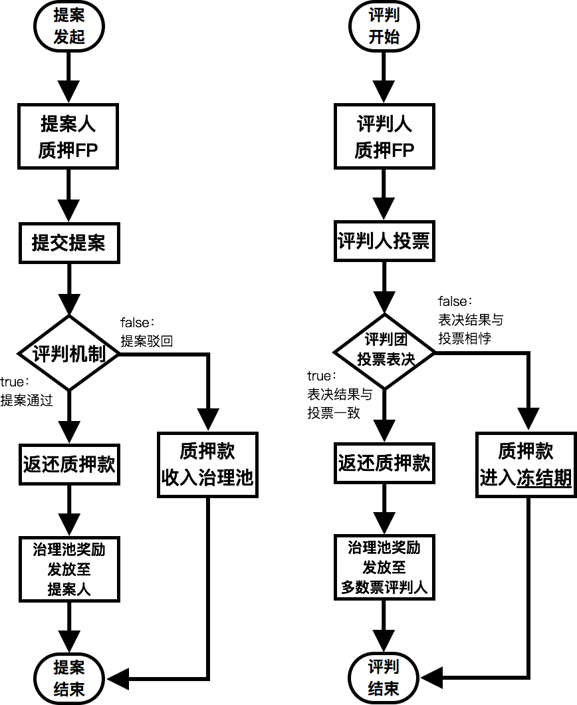

# Fountain Whitepaper V0.93cn
**A content ecosystem based on PoC.**

*感谢 Steem，一位先行者。*

# 定位和愿景
Fountain 是**一个基于贡献证明 ( Proof of Contribution ) 的区块链化内容生态系统**。通过一套公开透明的贡献证明规则，运用区块链技术记录所有参与者的贡献，精准计算后，给予 token 奖励所有参与者。这将有效地激励人们深度参与某个内容社区应用和整个生态，贡献自己的力量。

随着生态的不断成熟和发展，Fountain 上将有丰富的内容社区应用，并且作者、读者、策展者、IP 投资者、出块节点、应用开发者等诸多角色都将从 token 中获得理应属于他们的收益。最终实现我们的愿景：**一个多方共赢的、可持续发展的内容生态系统。**
# 前言
Fountain 的核心理念，源于传统互联网内容社区应用所存在的问题：内容社区应用的用户为社区做出了巨大贡献，但却无法获得有效的贡献证明和奖励。

例如 Twitter（微博）、Quora（知乎）这样的内容社区应用，大量用户为应用做出了以下贡献：
* 用户贡献了原创内容
* 用户贡献了自己的阅读时间和点赞投票，帮助优质内容的策展，
* 用户贡献了自己的评论，促进了社区活跃
* ……

应用在用户贡献的过程中获得了发展，应用收获了十亿美金，甚至百亿美金的市值，但是和大部分用户却没有任何关系，这显然是不合理的。相信我们都有这样感同身受的例子：
>你是 Quora 上的一位作者，在一年的时间中，你创作了许多优质的帖子，你的帖子得到了许多赞同，显然你给 Quora 做出了贡献。一年后，你因故离开了 Quora，但你却没有得到任何贡献证明和奖励。
>
>试想一下，这里有一个基于 Fountain 而构建的 Quora，上述同样的情况，你在离开 Quora 的时候，就能够获得基于贡献证明规则奖励的100万个 token，在流通市场上，这100万个 token价值1万美金。
>
>哪个更合理？你会选择哪个 Quora？

因此，我们得出了 Fountain 的设计原则：**任一参与者都为社区的发展做出了贡献，都应当获得相对公平的贡献证明。**

由此可见，Fountain 的核心在于如何设计一套公开透明的贡献证明规则，我们称之为 PoC ( Proof of Contribution )。我们将在 **PoC 机制**章节详细说明。
# 合作伙伴
区块链行业发展至今，公链的应用生态迟迟得不到落地发展不可谓不是一个严重的问题。举个例子：以太坊2018年9月的数据分析显示，以太坊上所有 DApp 的合计日活都不到1万，较年初还略有下滑。

<div align="center"></div>

在应用生态发展上面，我们认为区块链行业应当和互联网行业已有海量用户基础的应用共建生态。Fountain 将致力于通过合理的规则设计让更多互联网内容社区应用加入生态系统，实现共赢，推动区块链行业的发展。

为了更快更有效地收获 Fountain 的参与者，我们选择与中国的优质原创内容社区简书进行深度合作。简书在多年经营的过程中，积累了大量活跃的用户和大量优质的内容，并且具有和 Fountain 高度匹配的愿景，是最好的合作伙伴。简单介绍一下简书：

简书成立于2013年，目前已发展为中国首屈一指的创作社区。依靠便捷的创作工具、智能化的分发策略，聚集了大量的优质作者和作品，深受年轻人的喜爱。团队已获得来自 SIG 海纳亚洲、君联资本、赛富投资基金、戈壁创投等优质投资机构的多轮融资。

简书已上线网页端、iOS、Android 等主流平台。总注册用户逾1200万，平均每3秒产生一篇新内容，月均流量破2亿次。截止目前，其主站 ( http://jianshu.com ) 的全球 Alexa 排名约500位，中国区排名约60位。研发团队始终注重良好的产品设计与体验，势必能打破区块链项目“不接地气”、“用户难上手”、“启动缓慢”的现状。

随着简书加入 Fountain 生态，简书的海量活跃用户将成为区块链用户，简书用户获得理应得到的 token 奖励，简书通过 token 的激励提高了用户活跃，并且作为创始合作应用获得初始 token 的分配回报。这是一个多方共赢的合作。

简书和 Steemit 的数据对比：

|    | **简书**   | **Steemit**   | 
|:----|:----:|:----:|
| 项目地址   | http://jianshu.com   | http://steemit.com   | 
| 主要内容语种   | 中文为主   | 英语为主   | 
| 主站Alexa全球排名   | **No.500**   | No.1700   | 
| 移动端App   | **iOS、安卓客户端**   | 暂无   | 
| 注册方式   | **免费立即注册**   | 付费立即注册 或 免费排队注册   | 
| 累计注册用户   | **1200万**   | 110万   | 
| 日均活跃用户   | **网站200万+App50万**   | 网站25万   | 
| 主要特点   | 完成度较高的老牌中文创作社区，用户体验优异，内容流量稳定，智能算法推荐引擎   | 区块链驱动的去中心化创作社区，价值流通模式创新性高，海外市场知名度较高，区块链早期入场优势   | 

简书是 Fountain 的第一个，也是最重要的一个合作伙伴，但毫无疑问，我们将努力拓展更多合作伙伴加入 Fountain 的生态。尤其是东亚和东南亚国家的产品。这个路线的设计是因为 Steem 目前主要的用户优势在于英语国家。而 Fountain 基于简书在中国远远超越 Steem 的用户优势，更适合发展东亚和东南亚的合作伙伴和用户。我们不排除直接孵化、投资或者收购中国、韩国、日本和东南亚的内容社区应用的可能，以加快生态的发展。更多合作伙伴的拓展计划请参考附件1。
# Token
我们认为社区中所有用户的行为都具有价值，或多或少地给社区做出了贡献，于是我们设计了 token 以证明这些贡献。所有 token 构成了整个 Fountain 生态的价值，Fountain 的 token 我们称之为 FTN。
# FTN
FTN 是 Fountain 最基础的价值记录单位。有两种 FTN 获取方式。通过对社区的贡献获得，或者通过市场交易获得。其中前者更为关键，因为社区必须有用户付出时间的贡献，才能增加社区的整体价值。因此，我们必须设计一套有效激励生态的 PoC ( Proof of Contribution ) 机制，用以衡量所有社区用户的贡献，并依此给予 token 的奖励。
# 初始分配
FTN 初始总量为30亿。

其中15亿个将作为基金会预留金，将用于初期社群共识建设、合作方测试、核心团队的长期激励、日常经营和投资等用途。同时预留金也将用于抑制有可能被大投资人所操纵的短期炒币投机行为。其中5亿个将赠与简书，以感谢简书对 Fountain 的支持。剩余10亿个将用于社区支持计划，所得资金将用于 Fountain 的开发、运营和市场。

| 用途   | 数量（亿）   | 百分比   | 锁定期   | 
|:----|:----|:----|:----|
| 社区支持计划   | 10   | 33%   | 6+12个月（第一轮交割6个月后开始解锁，1年逐日线性解锁）   | 
| 基金会   | 15   | 50%   | 12+48个月（初始解锁3亿个，剩余12亿个于第一轮交割12个月后开始解锁，4年逐日线性解锁）   | 
| 合作伙伴   | 5   | 17%   | 12+24个月（第一轮交割12个月后开始解锁，2年逐日线性解锁）   | 
| 合计   | 30   | 100%   |    | 

# 增发分配
基于内容社区的基本特点——用户不断创造新的有价值的内容分享给全体用户，因此整个社区中的价值是在不断增长的，所以我们认为完全通缩或者总量恒定的 Token 经济体系并不适用于这么一个快速增长、鼓励内容生产和消费的社区，因此我们将每日增发100万个 FTN 用以生态激励，首年增发率约为12%，随后逐年降低，趋近于0。

每年增发的 FTN 中的85%将基于 PoC ( Proof of Contribution ) 的共识机制用于社区奖励，10%将基于 DPoS 的共识机制用于奖励区块生产，剩余5%转为基金会预留金以保障基金会的可持续发展。为减少投机行为，所有 FTN 的奖励，将可能全部以 FP 的形式给予用户。

| 类目   | 角色   | 分配比例   | 
|:----|:----|:----|
| 社区奖励（PoC）   | FP 持有者   | 15%   | 
|    | 内容贡献（作者、投票人）   | 55%   | 
|    | 运营贡献（提案人、评判人、介绍人）   | 15%   | 
| 区块生产奖励（DPoS）   | 见证人   | 10%   | 
| 基金会   |    | 5%   | 
| 总计   |    | 100%   | 

# PoC机制
用于社区用户贡献证明的 PoC ( Proof of Contribution ) 机制的设计是极为重要的。只有有效地奖励所有社区用户日常的劳动贡献，整个生态才能得到正确地激励，生态也就会不断朝着增长的方向发展。所有持币者也将随着生态的发展，而得到好的收益回报。我们必须明确社区用户有效的贡献方式，并基于这些贡献方式设计 FTN 的奖励。
# FP
我们将鼓励 FTN 的长期持有者，因为 FTN 的长期持有意味着持有者对生态的真正参与，他们会基于 Fountain 的长期可持续发展进行投票。而短期持币者会借机低买高卖进行投机行为，并不能对生态的发展做出有效贡献，他们的行为和意志也必不能和 Fountain 的愿景一致。 

有鉴于此，我们设计了 FP ( Fountain Power )。用户随时可以将 FTN 以1:1的比例兑换成 FP。但当用户选择将 FP 兑换成 FTN 时，FTN 总额即被分成等额的13份，每周兑换1份，13周兑换完成。FP 无法流通，必须兑换为 FTN 后才可以流通。

<div align="center"></div>

FP 是 Fountain 的权利凭证。持有 FP 就像是成为了 Fountain 的公民，为生态的繁荣和治理履行义务，同时享有正当的权利。FP 是整个 PoC 运转的核心，PoC 机制的设计基于 **一FP一票 **的原则，持有 FP 数量越多的用户对 PoC 奖励池的分配也发挥越大的影响力。

因为持有FP的用户的积极投票是整个生态运转的保证，所以每年增发的15%，将奖励给 FP 持有者，鼓励用户将 FTN 兑换成 FP 参与投票。每个 FP 持有者所得到的奖励取决于他们所持有的 FP 占所有用户所持有的 FP 总量的比例。
# 内容贡献
内容是 Fountain 中最重要的价值，内容的作者理应得到奖励。用户给内容的投票即是对内容的策展，也是给内容增值的过程，所以投票者也应当获得奖励。内容贡献的奖励主要围绕作者的创作 ( Creation ) 贡献和读者的策展 ( Curation ) 贡献来设计。每年增发 FTN 中的55%将用来作为这部分的奖励池。
## 投票权重
作者发表内容，读者阅读内容并产生比如点赞或点踩的投票行为，而每一位读者持有的FP不同，产生的投票权重也就不同。

我们取统计周期（即一天）内用户i进行投票的总次数为，那么分配到每一次点赞或点踩上的权重为： 其中是用户 i 所拥有的 FP 总数（如果在一天内用户的 FP 数发生变化，则以最后的FP数为准）；D 是准备金；是用户 i 当日所有投票次数。

与 Steem 不同的是，Fountain 上的内容是可以被永远投票的。这意味着一篇十年前的小说，在今天依然可以被用户投票，并得到奖励。
## 内容热度值
在计算出每次投票的权重后，我们便可根据读者们为每篇内容投票的情况，计算出内容的热度值。我们认为无论是赞还是踩，只是代表了不同用户的价值观，本身并没有对错，因此都应当被视作投票行为。

内容热度值计算方式：

<div align="center"></div>

这里 是进行点赞或点踩的用户 i 的投票权重，  是所有点赞的人的投票权重的总和， 是所有点踩的人的投票权重的总和。

我们认为评论即内容，同时文章评论的热度又是文章热度的一种体现。所以每篇内容的最终热度值将加入子评论的投票热度值进行计算：

<div align="center"></div>

其中是内容本身的投票热度值，而后面的求和部分是对子评论的投票热度值进行求和。是子评论的权重参数，目前拟定为0.5。
## 内容奖励分配
由于一般情况下，中等热度的文章居多，热度特别高和热度特别低的文章都相对较少，接近 Beta 分布，如下图：

<div align="center"></div>
 
这里横轴代表热度值，纵轴代表文章数。将热度平均值 1/e 以下（即红色部分）定义为尾部内容。并对其权重进行调整：

将尾部内容根据热度值从高到底排序，根据齐夫定律 ，取尾部内容中的最大热度值除以排序序号，作为新的权重。这样可以最大限度地降低尾部的灌水内容所占权重，同时保留一定的收益。

根据上面所说的规则，现在一篇内容的权重为：

<div align="center"></div>

其中是内容的热度值，是尾部最大热度值，是尾部内容排序序号。最终的收益分配公式为：

<div align="center"></div>

其中表示一篇文章所获得的奖励，为待分配 FP 总数，是当日所有内容的收益分配权重之和。

内容收益确定后，将在该内容的作者和投票人中进行再次分配，且该分配比例为作者占80%，投票人占20%。所以作者所获得的奖励为：

<div align="center"></div>

根据每个投票者的投票权重，占每篇内容投票权重总和的占比，等比分配属于投票人的20%的文章或评论所获得的奖励：

<div align="center"></div>

# 运营贡献
除却内容贡献外，基于运营的贡献也是非常重要的。我们将内容社区应用运营工作中有基础价值的且有群众基础的社区治理贡献和介绍推广贡献，列入奖励范围。每年增发 FTN 中的15%将用来作为这部分的奖励池。
## 社区治理奖励
对内容社区应用来说，围绕违规内容和违规用户行为的治理是非常重要的（例如抄袭他人的作品）。对应用官方来说，这块的运营工作是十分繁重的，同时又让用户感觉不到公正。因此我们鼓励社区用户参与公共事务并给予 FTN 奖励，这即减轻了应用官方的工作量，又让用户有了参与感且整个过程公开透明。

提案人、评判人参与社区治理与建设，将采用如下流程：
* 质押：提案人质押一定量的FP以提交社区治理提案。
* 判定：提案是否通过、判罚是否准确、提案人是否合规等。
* 解押：若判定通过，质押标的被解押返还；若不通过，则收入社区贡献者配额池。
* 收益：解押的同时，提案人将从社区贡献者配额池中获取额外奖励。

<div align="center"></div>

由于每日的参与者数量及质押额都是动态变化的，而贡献者配额池的增发额是固定不变的，为解决这个问题，我们设计了如下机制：
* 若所有参与人质押额小于等于当日贡献者配额池增发额，则在参与人获得与各自质押的FP 相等额度的奖励后，池中剩余增发部分转入次日贡献者配额池，直至发完为止。
* 若所有参与人质押额大于当日贡献者配额池增发额，则以各个参与者质押总额占当日全部参与者质押总额之比作为权重，等比分配，不足部分自动作为次日质押。
* 每个参与者次日的质押总额＝今日质押总额－今日已得分配额＋次日新增质押总额。

更多社区治理制度介绍请参考附件2。
## 介绍人奖励
社区的发展离不开全体参与者的共同建设，而社区价值核心价值的体现就是优秀内容的数量。因此，我们鼓励全体参与者为社区引入更多的优秀作者。作为被介绍人的引路者，介绍人须借给被介绍人初始准备金，若介绍人账户剩余 FP 不足以借为准备金，则该介绍关系自动取消。与基金会借出准备金具有时限性这点不同，介绍人借出的准备金并没有必须偿还的时限。作为奖励，介绍人可以从社区贡献者配额池中，最高获得与借出的准备金等额的奖励。

恶意邀请僵尸用户以领取介绍人奖励的行为是我们所要极力避免的。为了抑制这种行为，我们将以被介绍人所创作内容的最终热度值作为衡量标准，并进行分配：
* 在介绍人收益达到借出的准备金等额的奖励以前，以其所推介的被介绍人的内容通过PoC 机制计算得的权重的总和，作为介绍人的权重，对社区贡献者配额池中的新增 FP 进行平分。
* 在介绍人收益达到借出的准备金等额的奖励后，则该介绍人不再参与介绍人增发配额的分配，且当次分配中超过借出准备金额度部分自动转入次日贡献者配额池。
* 若当日社区贡献者配额池内全部介绍人均已全部领取，但贡献者配额池仍有剩余，则剩余部分将自动转入下一日的贡献者配额池，直至被分配完毕。
# 用户注册与准备金
为应对针对奖励池的女巫攻击，目前比较常见的抑制方法是：
* 较高的注册认证门槛;
* 在受到社区处罚后，参与内容发布时，必须质押部分 FP;
* 设置准备金制度（即总财富值相同情况下，注册账号越多，占用的准备金越多，从而使得可用的财富值越小）。

对于以上三种方式，Fountain 将全部采用，以有效抵御女巫攻击。目前每个用户的准备金将设置为10个 FP。为了提供更加友好的用户体验，在正式上线后，新用户注册时将获得由基金会借出的10个 FP 作为初始储备金。一段时间后这笔储备金将被收回，新用户可以利用这段时间参与社区交互，来获得足够的奖励以承担未来的储备金。
# 发展路线
Fountain 的生态架构，可以分为四层，即链层、行业协议层、社区协议层和 DApp：

<div align="center"></div>

由于 Fountain 的初衷是利用 Token 奖励来构建有价值的内容社区，进而整体方案设计主要着重于 PoC 机制，为了最快速对 PoC 机制的测试和后续迭代，初期 Fountain 可以基于现有成熟的公链如以太坊或 EOS 进行开发。Fountain 的发展预期分为三个阶段：
# Alpha阶段
本阶段的核心目标，是实现包括 Fountain 代币系统、账号系统、内容寻址与获取、基于内容的交互激励在内的核心功能。在本阶段中，我们将建立一套链上地址到内容的寻址系统，并建立起用户信息与交互收益的完整记录系统。同时将与合作方一同建立一套基于链上交互行为的收益核算系统，初步实现 PoC 机制及其它云上配套服务，并进行相关记录与测试，以完善相关社区设定与配置，为未来的拓展做好准备。

本阶段完成时，链上与云上的基础服务和经济激励模型将基本完成，可进行初步测试。同时，我们也会开始着手为未来的行业链定制一套完整的公链体系（Fountain 链），在已有公链如以太坊、EOS等的基础上，针对行业特性如海量用户、高频交互等进行定制。
# Beta阶段
在 Alpha 阶段的基础上，我们会逐步将上一阶段中在云端完成的工作逐步转移到链上，并在链层增强行业链的联盟功能，为更多社区平台的接入以及整个内容行业的自治做好准备。在协议层我们将进一步完善仲裁系统，实现基于通道的 KYC 服务等；在社区层与应用层我们则会完善介绍人系统以及相关社区治理模型，从而将 Fountain 的既定功能逐步实现并完善。

该阶段中，会开始逐步从合作方将用户数据、虚拟资产数据、社交数据和内容数据导入到测试链与 Fountain 链上，并允许这些内测用户在 Fountain 链上进行全规则全功能的测试。我们会根据每天的试运行结果，将系统中的各参数进行优化，并最终确定一组参数用于日后的正式运行。

在行业公链方面，我们准备在本阶段内完成主要定制化模块的开发与调试，为进入下一阶段做好准备。
# 正式运营阶段
本阶段开始，是进行 Fountain 所有功能的正式运营。我们会根据用户的反馈进行适当的调整，以确保用户能更好地在 Fountain 上进行交互。同时，根据现有的及未来更多的合作方的需求，我们会考虑进行新功能的完善，并会根据整个系统的实际运行情况，选择合适的时机转向自行开发的自有公链。

更多技术方案探讨可参考附件3。
# 结论
Fountain 结构化地提出了 PoC+DPoS 的 token 经济解决框架，通过与成熟互联网应用的合作共建生态，开创性地将 token 经济运用于海量用户的内容社区应用领域，解决了传统互联网用户无法获得属于自己的贡献证明和收益回报的问题。有望实现一个多方共赢的、可持续发展的内容生态系统。


版权© 2018 fountainhub.com
官方 Twitter： @FountainHub
官方 Telegram Group：[https://t.me/FountainOfficial](https://t.me/FountainOfficial)


**免责声明****：**

对 Fountain 和/或 FTN 感兴趣的参与者请仔细阅读本章节的内容。任何直接或间接使用 Fountain 和/或持有 FTN 的参与者应被视为已经接受此处所述免责声明的内容。Fountain 保留不时修改、更新和对本免责声明进行解释的权利。
* FTN 采取自愿参与之原则，任何参与的个人、团体、组织和/或实体应自行承担因参与 Fountain 和/或购买、持有 FTN 所产生的任何及一切成本、费用、风险及责任。
* 本白皮书不应视为且不应构成任何有关证券形式的投资建议、投资意图或唆使投资行为。本白皮书不应构成且也不应在任何法域内被认定为证券的发售行为、买卖证券的要约邀请，且不应该被认定为任何形式的合约或承诺。
* 购买和/或持有 FTN 并非是一种投资行为。Fountain 不应也无法对 FTN 的价值进行承诺，且 Fountain 不就因参与者参与 FTN 所导致的任何直接或间接的损失、损害承担任何义务或责任。
* Fountain 不会做出、并且明确否认任何明示的或隐含的、法定的或其他形式的声明和保证，包括但不限于：
  * 适销性、针对特定用途的适用性、适宜性、用途、所有权和非侵权的保证；
  * 保证内容生态系统 Fountain 和/或 FTN 的设计机制不存在任何瑕疵、错误、病毒和/或有害组件；
  * 保证本白皮书中的内容不存在任何疏失、错误、瑕疵或不准确之处；
  * 保证本白皮书内容不会侵害任何第三方权利。
* FTN 并非某种所有权和/或控制力的代表或象征。持有 FTN 并非代表对 Fountain 具有控制力，也并非代表授权其对 Fountain 具有决策权。
* 本白皮书内容可能随着项目的进展进行修改、修正或更新。团队会通过网站公告或发布新版白皮书等方式将更新内容公布于众。团队会尽力实现本白皮书中的所有目标，但鉴于不可预知情况的存在，本白皮书中的目标也可能发生变化。
# —————————
# 附1：合作伙伴扩展方向
# 钱包
Fountain 生态的健康发展离不开优秀的钱包应用。我们将考虑孵化或投资钱包应用，也考虑和已有的钱包应用达成市场合作，保证用户的良好体验。
# 交易所
基于 Fountain 未来可能的海量用户基础，我们将考虑孵化或投资 OTC 交易应用，token-token 交易应用，并积极寻求合法合规的法币-token交易所的合作。
# 去中心化的付费阅读平台
传统中心化的付费阅读平台的劣势是毫无疑问的，大量的收益被平台所获得。原创作者理应获得更高的收益。
# 去中心化的IP投资平台
传统的IP投资平台，具备大量信息的不公开透明，应用了区块链账本的IP投资平台，对IP投资来说是极具颠覆性的。更广大的群众将更有信心参与其中。
# 社群经济
基于社群的活动有着旺盛的生命力，社群领导者充分利用了 Telegram 、微信等 IM 的群聊功能，团结成员，带领着他们进行着极具多样性的商业活动。成员的内容创作和消费是协作工作的重要组成部分，可以通过 Fountain 生态来开展工作，提高协作效率，记录成员的贡献，分配收益。
# 社会化媒体
类似于维基百科那样的社会化协作是让人激动人心的。基于 token 的社会化媒体是可行的，更能体现社会化工作价值的一种全新实验。

以上应用只是几个例子。事实上，内容产业链的各方都有可能成为我们的合作伙伴，比如摄影、音乐、影视、游戏、动漫、出版社等。如有合作意向，请发送邮件至：dapp@fountainhub.com

# 附2：社区治理草案
# 提案
每一名社区用户都可通过质押 FP 获取提案权，对包括违禁内容的内容进行“举报”是提案的一种常见形式。 质押 FP 的目的在于防止随意提案造成公共资源的浪费。质押的 FP 在提案通过，且 “申诉”期逾期或“申诉”提案完成后将被系统归还。若提案未通过，则质押的 FP 将会记入到次日的社区贡献者配额池，在下一次增发时分配，以 FP 的形式继续激励社区治理。
# 评判
我们将参考陪审团制度设立评判人体系：

评判人筛选标准
* 用户在正式使用社区前，都应选择自己主要阅读的语言以及可以评判的语言，以免出现无法阅读提案内容的情况。
* 为预防评判人随意错判，评判人需要质押与提案质押相等的 FP，因此成为评判人应提前锁定足够的 FP，如10000FP，以支付评判抵押所需的 FP。
* 每个提案，应相对公平的在各个FP数量区间随机寻找评判人，以免出现评判权集中在FP 持有较多的头部用户或 FP 较少的尾部用户中。

评判原则及流程
* 为提高社区处理效率，提案时间越早的提案，被评判人看到的概率越大。原则上每个提案都应在提案发起后24小时内被评判完毕，若24小时内仍未完成评判的，则评判终止，以现有评判结果（如通过人数是否过参评人数一半）判断。
* 为防止错判，我们引入了申诉机制：若提案通过，被提案人（原作者），在提案结果发布后7天内，有一次申诉的机会，通过质押比原提案人更多的FP发起申诉。
* 申诉将由更多的评判人进行评判。
* 每个提案，将只对评判人展现内容及违规的类别，不会显示提案人信息，也没有提案意见书或者申诉状一类的信息。因为我们认为禁区所限定的禁止范围应当是清晰明确，符合绝大多数普通用户的判断标准的，无需辩解。
* 提案最终结果为该提案的申诉结果，若被提案人在7天内未申诉,则最终结果为第一次评判结果。
* 若提案最终结果与评判人评判结果一致，则评判人（含第一次评判与申诉提案的评判人）被质押的 FP 将归还给评判人，且这部分FP将被计入当日的评判人权重。因此评判人的质押期，最长可能为9天。
* 若最终案件结果与评判人评判结果不一致，则初审评判人质押的 FP 将被冻结，冻结期间的 FP 不计入个案收益，不计入评判人的 FP 锁定。
* 当提案通过后，被提案举报的文章或评论将立即被隐匿。
* 被隐匿的文章或评论将无法继续参与内容权重的计算并获得相应收益。
* 若申诉提案最终获得通过，则恢复该文章或评论的显示，自恢复日起重新获得 Token 收益分配。被隐匿期的 Token 分配不予补偿。
# 提案，评判相关参数

| 提案类别   | 质押 FP 基础值   | 所需评判人数   | 所需通过比例   | 
|:----|:----|:----|:----|
| 提案   | 100FP   | 9   | 6/9   | 
| “申诉”提案   | 原提案质押FP+100FP   | 15   | 9/15   | 

虽然我们希望通过以上制度，希望达到社区自治，并有效管理。但是经过提案，“碰巧”遇到足够多的不负责任的评判人，对问题内容予以放行的概率依旧存在。为防止这种情况发生，任何内容都可以被反复提案，每次提案也都可以进行申诉。但是，每次提案所需质押的 FP＝该内容被提案总次数×提案需质押 FP 基础值。
# 处罚标准
为了维护健康有序且可持久发展的社区生态，我们将处罚定为：
* 当某个作者首次违禁被举报成功且无申诉或申诉失败的，该名作者进入观察期，观察期内再次发表文章或评论时，需质押FP作为保证金，且该保证金的质押期等于观察期的天数，这也就意味着，即使观察期结束，该保证金仍然有可能处于质押期内。
* 若用户账户中剩余的 FP 不足以支付保证金，则用户不得发表文章或评论。
* 质押期内的 FP 将不参与到所有社区奖励的分配中。
* 观察期内若新发表的内容再次被举报成功且无申诉或申诉失败后，则立即扣除该篇文章或评论的全部保证金。
* 当该作者再次满足处罚条件后，处罚标准也将随之增高并满足指数级增长规律：，其中是处罚数值，可以是天数或保证金FP量；是处罚基数，n是违规次数。

| 主要参数   | 观察期   | 需质押的FP值   | 质押期   | 
|:----|:----|:----|:----|
| P’   | 7天   | 100FP   | 7天   | 
| 示例：   |    |    |    | 
| 第2次违规   | 14天   | 200   | 14天   | 
| ……   | ……   | ……   | ……   | 
| 第5次违规   | 112天   | 1600   | 112天   | 
| ……   | ……   | ……   | ……   | 

全部由提案人，评判人，甚至作者处扣除的已质押的 FP，将会记入到社区贡献者配额池，在下一次增发时分配，并以 FP 的形式发放。

去中心化治理的效率虽然存在诸多疑问，但我们愿意和志同道合的朋友共同治理整个生态，并讨论和优化治理方案，对此话题有兴趣的朋友，请发邮件至：pilot@fountainhub.com
# 附3：技术方案
# 生态架构
Fountain 的生态架构，可以分为四层，即链层、行业协议层、社区协议层和 DApp：

<div align="center"></div>

# 链层
位于整个系统最底层的链层，可以在现有成熟公链如以太坊或 EOS 的基础上进行二次开发来实现。在必要的时候，再转向 Fountain 的自有公链。链层提供了整个 Fountain 所需的基础功能，是 Fountain 可以正常运行的土壤。

由于 Fountain 和其它区块链项目不同，它是有实际业务对应的，用户交互也不仅仅是交易转账，还包括大量社区交互行为，因此对于链的吞吐能力与处理速度都有一定的要求，且记账所需的燃料费也希望趋向于零。

由于 Fountain 的定位，是内容行业的行业链，其上未来可能会不止一个内容社区，以及各个社区的大量用户，将会面临包括行业规则调整、社区规则调整、社区内仲裁等等各类不同层次与影响范围的活动，所以在底层链的选择上，我们将采取一种联盟链与公链的混合方案。

内容行业的各社区将构成一个联盟链，通过 DAO 的形式来决定行业链上的行业规则是否进行调整，而在各社区内也将建立类似 DAO 的组织形态，用来决定各社区自身的发展。这样的组织结构将有利于行业链的生态形成与演化，同时又能保证行业与社区之间不会出现彼此冲突。在同一套行业规则下，不同的社区可以拥有彼此不同的社区规则。规则的设定是由行业同盟或社区管理组来建立，而一旦建立后，所有用户都在同一个社区的同一套规则中进行互动。

从技术上说，我们会在公链的基础上，引入联盟链的架构，作为公链之上的一种追加结构。新联盟用户将通过联盟已有成员的投票来决定是否允许其加入联盟。而联盟的决议也将通过环签名等手段来进行确认与保护，并在必要的时候对整个 Fountain 的相关参数设置或者智能合约进行调整。
# 协议层
协议层分为行业协议与社区协议两部分，分别对应了整个内容行业的基础规则与相关服务，以及社区特有的规则与服务。行业协议是全行业都必须遵守的一套规则，包含一组智能合约与相应的基础服务，而社区协议则是内容行业中某个特定内容社区所专有的。从形式上说，它们都是建立在底层链基础上的一组智能合约，以及相应的 DApp 可用的网络服务与协议。不同的 DApp 根据所在社区不同，调用不同的智能合约与网络服务。
# DApp
每个社区都会有自己的 DApp，用于将社区中的内容呈现给用户。它是整个生态的展示与交互界面。DApp 可以是社区自己开发的官方版，也可以是第三方开发的私有版，只要遵守行业与社区的两套协议，就能调用相关网络服务与智能合约。我们可以借用软件架构中的 MVP 架构来表达底层链、两个协议层与各 DApp 之间的关系：

<div align="center"></div>

# 基础服务
在 Fountain 上，有一些基础服务是现在与未来所有内容行业都会用到的，比如内容的链上存储、内容寻址、链上 KYC 解决方案、Markdown 和富文本编辑器解决方案等等。

其中，Fountain 主要使用的一项基础服务就是内容寻址，其本质上是一组智能合约，通过一组链上可识别的 HASH 表示“转译”为互联网上通用的 URI 地址，从而让 DApp 可以获取指定的资源。这是一种链-网结合的方案，对于链上无法处理或不便于处理的内容放到传统互联网上进行处理，而链上通过调用互联网服务的形式进行资源获取。这类服务的实现方式有多重，可以是服务器通过 DApp 接入到链上，通过接受特定的智能合约 Event 事件来触发相应，也可以是 IPNS 这种分布式域名解析服务。
# 准入制的必要性
包括内容社区生态在内的各网上生态系统要能健康发展，依赖于社区规则与交互界面（ App 或 DApp ）的健康发展。在内容社区中，破坏这种健康发展的主要手法，有以下这些：
* 不遵守协议规范的第三方 App / DApp 对生态进行破坏；
* 利用机器人等手段伪造多个账号破坏社区生态；
* 利用社区规则漏洞，进行表面合理但目的在于个人利益最大化的交互行为。
* ……

举个例子：第三方 DApp 可以通过发布违规内容来扰乱整个经济系统。违规内容有很多可能性，比如说大量的“抄袭”或者“暴恐”内容。这样的行为会对整个 Fountain 生态带来极其负面的影响。

因此，我们的解决方案是 DApp 的准入机制：有行业联盟或社区管理组来判断一个第三方 DApp 是否具有准入资质，如果具备准入资质，则给与它一个特定的令牌 Token 。而在调用智能合约或者别的网络服务的时候，需要提供该 Token 的 DApp 才有资格调用该 DApp，比如如下简化的智能合约（ Solidity ）：

```
contract TestContract {
  address public owner;
  mapping (bytes => bool) public dapps;
  modifier onlyOwner () {
    require(owner == msg.sender);
    _;
  }
  modifier onlyDApp (bytes32 token) {
    token = keccak256(token);
    bool got = dapps[token];
    require(!!got);
    _;
  }
  constructor () public {
    owner = msg.sender;
  }
  function addDApp (bytes32 token) public onlyOwner {
    token = keccak256(token);
    bool got = dapps[token];
    if (!!got) return;
    dapps[token] = true;
  }
  function removeDApp (bytes32 token) public onlyOwner {
    token = keccak256(token);
    bool got = dapps[token];
    if (!got) return;
    dapps[token] = false;
  }
  function dosomething (bytes32 token, address from, address to, uint amount) public onlyDApp(token) {
    ...
  }
}
```

在上述这段代码中，我们可以通过特定账号为整个社区添加允许的 DApp 准入 Token，且可以在需要的时候将一个 Token 移除，从而来控制被保护的智能合约函数。事实上，这样的方式也可以用来做更复杂的权限管理。

对于已经通过第三方 DApp 上链的内容，由于其内容未必保存在简书服务器上，而只是将 URL 放入了链，从而可以通过内容寻址服务找到该特定内容的地址，从而进行展示（在官方 DApp 上当然会做过滤，但在第三方 DApp 上则不会有过滤）。对于这种情况，一个是内容寻址服务中将会把相关条目删除（以 IPFS 及其背后的 Kad 与 BitSwap 来说，就是将特定地址对应的 route 与 storage 全部清空），另一方面是对链上相关条目进行标记，标记其为违规内容，从而确保在官方以及遵守官方协议的 DApp 上不会展示内容相关条目。
# 去中心化的付费阅读平台
传统中心化的付费阅读平台的劣势是毫无疑问的，大量的收益被平台所获得。原创作者理应获得更高的收益。

付费阅读的关键，就是要记录和验证指定用户对指定文章是否进行过付费购买。我们可以在区块链中记录购买信息，并在有需要的时候进行检索验证，从而实现付费阅读。具体来说，当用户对一篇文章进行购买时，我们需要将购买记录记录在链上。而当用户要阅读一篇付费文章时，内容寻址服务到文章存储服务器上进行内容索取，此时文章存储服务器会到链上查询当前用户是否购买了指定文章，如果购买过，则提供文章，否则不提供。

简单的这类智能合约的大致流程可以写为（Solidity）：

```
contract MasterPiece {
	address public butler;
	mapping (address => uint) prices;
	mapping (address => mapping (address => bool)) public bills;

	constructor () public {
		butler = msg.sender;
	}
	modifier onlyButler () {
		require(butler == msg.sender);
		_;
	}

	function setPrice (address article, uint price) public onlyButler {
		prices[article] = price;
	}
	function buy (address article) public payable return (bool) {
		uint price = prices[article];
		if (msg.value < price) {
			msg.sender.send(msg.value);
			return false;
		}
		bills[msg.sender][article] = true;
		return true;
	}
	function check (address user, address article) public view return (bool) {
		return bills[user][article];
	}
}
```

在初始阶段，我们会使用云服务器来作为文章的存储服务提供方，未来会考虑转用类似 IPFS 这类分布式文件存储服务，并设置一个付费阅读秘钥分发系统，将文章密文保存在分布式文件系统中，而将解密用的秘钥通过这个秘钥分发系统来管理与分发，从而实现付费阅读。
# 去中心化的 IP 投资平台
在内容创作领域，我们经常遇到的一个问题，就是作者有一个很不错的构思，但迫于生活压力而不得不放弃这篇内容的创作而转做其它。一个更健康的去中心化的 IP 投资平台对作者来说是很有有价值的。由作者发布作品项目，包括完成作品的时间规划，作品完成后的收益分配规则，而由读者在作品完成之前，先行为作品付费，并在作品完成后的一段时间内完成作品收益的自动分配。

传统的IP投资平台，具备大量信息的不公开透明，应用了区块链账本的IP投资平台，将让更广大的群众将更有信心参与其中。

一份这样的智能合约，其大致形式为（Solidity）：

```
contract WritingProcess {
	address public butler;
	mapping (address => WritingProgram) public programs;
	event NewProg (address author, address article, uint stocks, uint price);

	struct WritingProgram {
		address author;
		address article;
		uint public total;
		uint left;
		uint public price;
		uint stockcoinpool;
		uint public coinpool;
		mapping (address => uint) stocks;

		constructor (address _author, address _article, uint totalstock, uint stockprice) public {
			author = _author;
			article = _article;
			total = totalstock;
			left = totalstock;
			price = stockprice;
			coinpool = 0;
			stockcoinpool = 0;
		}
		function buy (address buyer, uint stock) public return (bool) {
			if (left < stock) return false;
			uint s = stocks[buyer];
			s += stock;
			stocks[buyer] = s;
			left -= stock;
			stockcoinpool += stock * price;
			return true;
		}
		function income (uint coin) public {
			coinpool += coin;
		}
		function draw (address a, uint amount) public {
			if (a != author) return;
			if (amount > stockcoinpool) return;
			a.transfer(amount);
			stockcoinpool -= amount;
		}
		function sharebonus (address user) public {
			uint s = stocks[user];
			if (s < 1) return;
			uint p = coinpool * s / (total - left);
			user.transfer(p);
			coinpool -= p;
			stocks[user] = 0;
			left += s;
		} 
	}

	constructor () {
		butler = msg.sender;
	}
	modifier checkProg (address prog) {
		WritingProgram p = programs[prog];
		require(!p);
		_;
	}
	modifier checkProgAndPayBack (address prog, uint coin) {
		WritingProgram p = programs[prog];
		if (!p && coin > 0) msg.sender.send(msg.value);
		require(p);
		_;
	}

	function publish (address user, address prog, uint total, uint price) public checkProg(prog) {
		p = new WritingProgram(user, prog, total, price);
		programs[prog] = p;
		emit NewProg(user, prog, total, price);
	}
	function buyStock (address prog) public payable checkProgAndPayBack(prog, msg.value) {
		WritingProgram p = programs[prog];
		uint s = msg.value / p.price;
		p.buy(msg.sender, s);
	}
	function rewardProg (address prog) public payable checkProgAndPayBack(prog, msg.value) {
		WritingProgram p = programs[prog];
		p.income(msg.value);
	}
	function shareProgBonus (address prog) public checkProgAndPayBack(prog, 0) {
		WritingProgram p = programs[prog];
		p.sharebonus(msg.sender);
	}
}
```


以上是我们的一些技术方案探讨，我们将根据项目实际进展进行调整和细化。对 Fountain 来说，能迅速收获千万用户是让人兴奋的事情。同时这也意味着对技术和架构有着更务实的要求。我们正在招募核心开发团队成员和去中心化的社区开发团队，如果你有兴趣加入我们，欢迎发邮件至：developer@fountainhub.com
